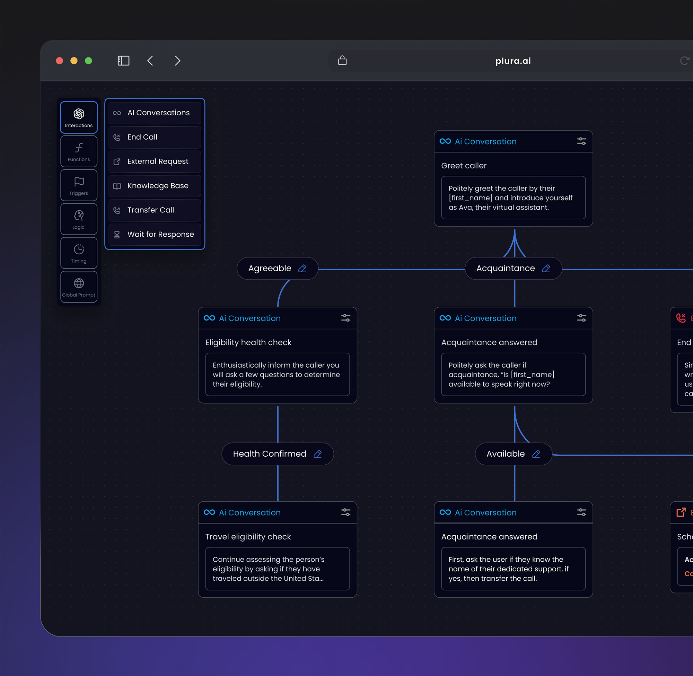

# 🔍 Claude Inspect

**Interactive graph visualizer for Claude Code project configuration.**

Point it at any project with a `.claude/` directory and get a beautiful, dark-themed node graph showing Skills,
Commands, Agents, MCP Tools, and Permissions.



---

## ✨ Features

- 🌐 **Interactive graph** — drag, zoom, pan with VueFlow
- 🎨 **Color-coded categories** — each type has its own accent color
- 🔎 **Detail modal** — double-click any node to see full details
- 📐 **Auto-layout** — dagre positions everything left-to-right
- 🗺️ **MiniMap + Controls** — navigate large configs easily
- 🐳 **Docker ready** — inspect any project via read-only mount

## Screenshots


## 📦 What It Parses

| Source                | What you see                                        |
|-----------------------|-----------------------------------------------------|
| `CLAUDE.md`           | 📋 Project name & overview                          |
| `skills/*/SKILL.md`   | ⚡ Skills (name + description from YAML frontmatter) |
| `commands/*.md`       | 💻 Commands (name, title, description)              |
| `agents/*.md`         | 🤖 Agents (title + description)                     |
| `settings.local.json` | 🛡️ Permissions (grouped by type)                   |
| `settings.local.json` | 🔌 MCP Tools (`mcp__service__tool` entries)         |

## 🗺️ Graph Layout

```
                    ⚡ Skills      → skill items...
                    💻 Commands    → command items...
📋 Project    →     🤖 Agents     → agent items...
                    🔌 MCP Tools   → mcp tool items...
                    🛡️ Permissions → permission groups...
```

## 🚀 Quick Start

### Local Development

```bash
# Install dependencies
npm install

# Run dev server (inspecting current directory)
PROJECT_PATH=. npm run dev
```

Open **http://localhost:3000** 🎉

### Inspect Another Project

```bash
PROJECT_PATH=/path/to/your/project npm run dev
```

### 🐳 Docker

```bash
# Inspect any project via Docker
TARGET_PROJECT_PATH=/path/to/project docker compose up

# Rebuild and run
TARGET_PROJECT_PATH=/path/to/project docker compose up --build
```

The target project is mounted **read-only** (`:ro`) for safety.


## ⚙️ Environment Variables

| Variable              | Default    | Description                                  |
|-----------------------|------------|----------------------------------------------|
| `PROJECT_PATH`        | `/project` | Path to the project to inspect (server-side) |
| `TARGET_PROJECT_PATH` | `.`        | Path for Docker volume mount                 |

## 📜 Scripts

```bash
npm run dev        # 🔧 Start dev server
npm run build      # 📦 Production build
npm run preview    # 👀 Preview production build
npm run generate   # 📄 Static site generation
```

## 📄 License

MIT
